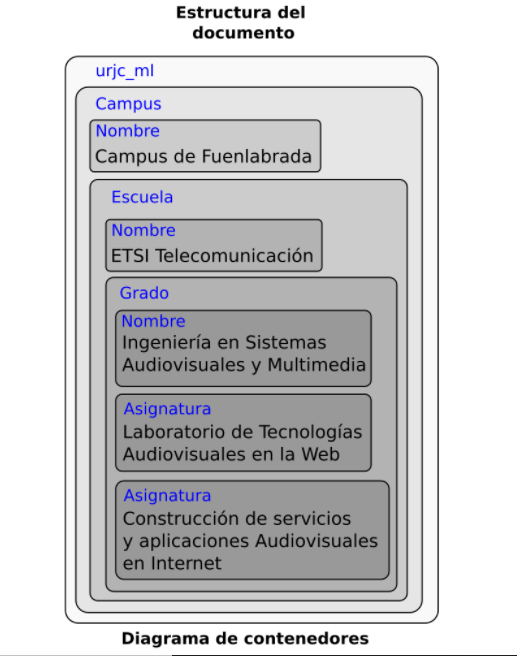

# Ejercicio 1
1. Explica para qué sirve la primera línea del documento y por qué es necesaria

**La primera linea nos indica que tipo de documento es. Se encuentra en el fichero local urjc_ml.dtd. El programa que haga el procesado de este documento deberá abrir primero el documento de la definición para saber qué etiquetas son válidas y poder así validar el documento o encontrar errores en su sintáxis**

2. Si se omitiese esta línea, ¿Qué piensas que ocurriría?

**Al no incluirse esa línea, el analizador sintáctico no sabrá de qué tipo de documento se trata, y por tanto no podrá analizarlo. Se producirá un error**

3. Sin conocer el contenido del fichero urjc_ml.dtd, ¿el documento es sintácticamente correcto?

**En el documento DTD están definidas las etiquetas de nuestro lenguaje. Sin saber su contendio no tenemos ni idea de si las etiquetas usadas son válidas o no. Por ello NO PODEMOS DETERMINAR si es correcto o no. (Por ejemplo, la etiqueta podría ser que no estuviese definida, o que la etiqueta para definir un nomobre fuese . No lo sabemos)**

4. ¿Qué hace la tercera línea?

**Es un comentario, no hace nada**

5. ¿Cuantas etiquetas de apertura hay? ¿Cuantas de cierre?

**Un total de 9 etiquetas, 9 de cierre, 9 de apartura**

6. Dibuja el diagrama de contenedores de este documento

7. Dibuja la estructura en árbol que define este documento

>Añadir foto del cuaderno